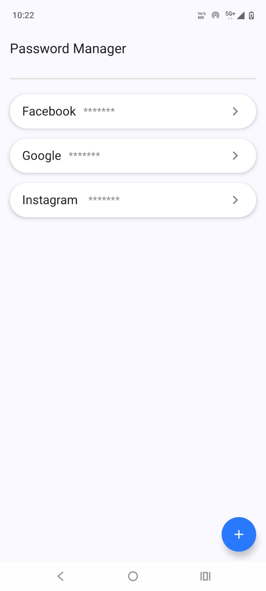

# 🔐 Password Manager App

A modern, secure, and user-friendly **Android Password Manager App** built using **Jetpack Compose**, **Room Database**, and **Material 3**. This app allows users to safely store, view, edit, and delete their login credentials for different accounts.

---

## ✨ Features

- 📄 Add, edit, and delete password entries
- 🔒 Toggle password visibility
- 🧠 Remember multiple accounts with title, username/email, and password
- 💾 Secure local storage using Room database
- 🎨 Built with Jetpack Compose and Material 3 UI
- 📱 Clean, minimal, and responsive design

---

## 🛠️ Tech Stack

- **Jetpack Compose** - Modern UI toolkit for Android
- **Room Database** - Local data persistence
- **Material 3** - Latest Material Design components
- **Hilt** - Dependency injection
- **Kotlin** - Modern and concise programming language

---

## 🚀 Screenshots



---

## 📦 Setup Instructions

1. Clone the repo:

```bash
git clone https://github.com/your-username/password-manager-app.git
cd password-manager-app
Open the project in Android Studio.

Make sure the following dependencies are included:

kotlin
Copy
Edit
// build.gradle (app)
implementation "androidx.navigation:navigation-compose:2.7.7"
implementation "androidx.room:room-runtime:2.6.1"
kapt "androidx.room:room-compiler:2.6.1"
implementation "androidx.room:room-ktx:2.6.1"
implementation "androidx.hilt:hilt-navigation-compose:1.2.0"
implementation "androidx.compose.material3:material3:1.2.1"
Run the app on an emulator or physical device.

📂 Folder Structure
bash
Copy
Edit
com.example.app/
├── data/               # Room entities, DAO, database
├── di/                 # Hilt modules
├── presentation/       # Compose UI screens
├── util/               # Utility classes (e.g. encryption)
├── MainActivity.kt     # Entry point
🔐 Security
Passwords are encrypted before being stored in the Room database. Only the app can decrypt and access them securely.
